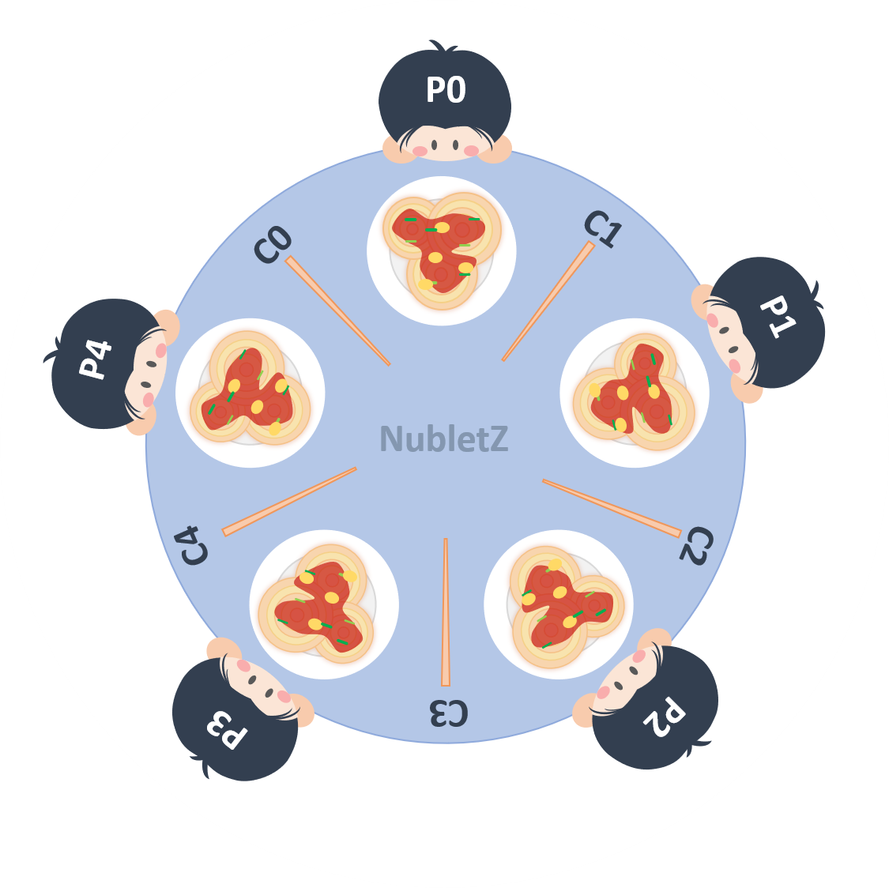

# Week 10 Notes
## Mutex and Semaphore
Both mutex and semaphore are kernel resources that provide synchronization services. But they are two different things.

### Mutex (Mutual Exclusion)
Mutex is like a key, it works with locking mechanism that makes sure only one thread can work with the entire buffer.


### Semaphore
Semaphore is a signaling mechanism. It uses two atomic operation, wait and signal for the process sychronization. Semaphor can separate a single 4 KB buffer into four 1 KB buffers and let users and producers to work on different buffer at the same time.

<br>

> C = chopstick, P = philosopher

The dining philosophers problem is a well known example to illustrate the synchronization problem in computer science. Take a look on the picture above. For example there are 5 philosophers that want to eat, each of them need 2 chopsticks to start to eat. The problem is there are only 5 chopsticks on the table. If each philosopher ( philosopher[i] ) take the chopstick on their right side ( chopstick[i] ) then it would be a deadlock since the left chopstick ( chopstick[(i+1)%5] ) was taken by the other philosopher ( philosopher[(i+1)%5] ). So to solve this problem we can use semaphore method.

```
#include<stdio.h>
#include<stdlib.h>
#include<pthread.h>
#include<semaphore.h>
#include<unistd.h>

sem_t room;
sem_t chopstick[5];

void * philosopher(void *);
void eat(int phil, int c2);
int main()
{
	int i,a[5];
	pthread_t tid[5];
	
	sem_init(&room,0,4); //in sem_init() 0 means this thread share resource between threads else it share resource between processes
	
	for(i=0;i<5;i++)
		sem_init(&chopstick[i],0,1);
		
	for(i=0;i<5;i++){
		a[i]=2*i%5; //Set the philosopher that entering room to have 1 seat distance
		pthread_create(&tid[i],NULL,philosopher,(void *)&a[i]);
	}
	for(i=0;i<5;i++)
		pthread_join(tid[i],NULL);
}

void * philosopher(void * num)
{
	int phil=*(int *)num;

	sem_wait(&room);
	printf("\nPhilosopher %d has entered room",phil);
	sem_wait(&chopstick[phil]);
	sem_wait(&chopstick[(phil+1)%5]);

	//sleep(1);
	eat(phil, (phil+1)%5);
	sleep(2);
	printf("\nPhilosopher %d has finished eating",phil);

	sem_post(&chopstick[(phil+1)%5]);
	sem_post(&chopstick[phil]);
	sem_post(&room);
}

void eat(int phil, int c2)
{
	printf("\nPhilosopher %d is eating spagetti using chopsticks %d and %d", phil, phil, c2);
}
/* BY - ANUSHKA DESHPANDE */
```
> code reference : [The Dining Philosophers Problem Solution in C](https://medium.com/swlh/the-dining-philosophers-problem-solution-in-c-90e2593f64e8)

If you still unfamiliar with the code above please open the reference website to see the detail explanation. I have done some modification to the original code so it's able to let multiple philosopher eating spagetti at the same time. To understand the program flow, take a look at the illustration below.

<br>

1). At first we would only let 4 philosopher to enter the room so that we can avoid deadlock.
```
sem_init(&room,0,4);
```

2). Each philosopher who enter the room will sit on one seat apart from the semaphore that has entered the room before him, this way both left and right chopstick is available to be use by philosopher as long as no one has enter the room before him and sitting the seat next to him.
```
for(i=0;i<5;i++){
		a[i]=2*i%5; //Set the philosopher that entering room to have 1 seat distance
		pthread_create(&tid[i],NULL,philosopher,(void *)&a[i]);
	}
```
In this case P3 enter the room first and start to eat using C3 and C4, P1 also enter the room and start to eat using C1 and C2, then P4 and P1 enter the room, but because there is only one chopstick that is available so they keep wait until other chopstick is available. 

3). After philosopher has finished eating, it will put down the chopstick and leave the room, so the chopstick become available to be use by the other philosopher and another philosopher can enter the room.

Output (output sequence might be different depend on your device) :
```
Philosopher 3 has entered room
Philosopher 3 is eating spagetti using chopsticks 3 and 4
Philosopher 1 has entered room
Philosopher 1 is eating spagetti using chopsticks 1 and 2
philosopher 4 has entered room
Philosopher 2 has entered room
Philosopher 3 has finished eating
Philosopher 4 is eating spagetti using chopsticks 4 and 0
Philosopher 0 has entered room
Philosopher 1 has finished eating
Philosopher 2 is eating spagetti using chopsticks 2 and 3
Philosopher 4 has finished eating
Philosopher 0 is eating spagetti using chopsticks 0 and 1
Philosopher 2 has finished eating
Philosopher 0 has finished eating
```