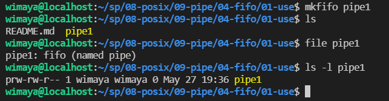

# Week 13 Notes
## FIFO
FIFO is a named pipe and it is one of the methods for intern-process communication. This FIFO can life in the process as long as the system is up and it can be deleted if no longer used.

This special file can be entered into the filesystem by calling mkfifo(). This function need `sys/types.h` and `sys/stat.h` as its headers. To create the FIFO file in our program we can type the following code

```
#include <sys/types.h>
#include <sys/stat.h>

int mkfifo(const char *pathname, mode_t mode);
```

in Linux we also can use a `$ mkfifo` command to create a named pipe.



Next we will use this `pipe1` to build an internal communication. Put the process to read mypipe2 in the background and you will recieve the PID of it.

```
$ cat < mypipe2&
[1] 1660436
```

Use `$ echo` and type a string as an input for `mypipe2`. After execute this command, your string would be printed by the process `cat` that you run before to read `mypipe2`. After success printing the content it will be terminated.

```
$ echo "testing" > mypipe2
$ testing

[1]+  Done                    cat < mypipe2
```
