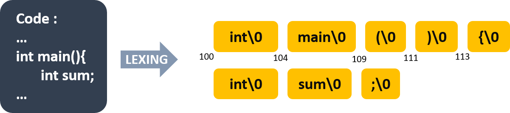
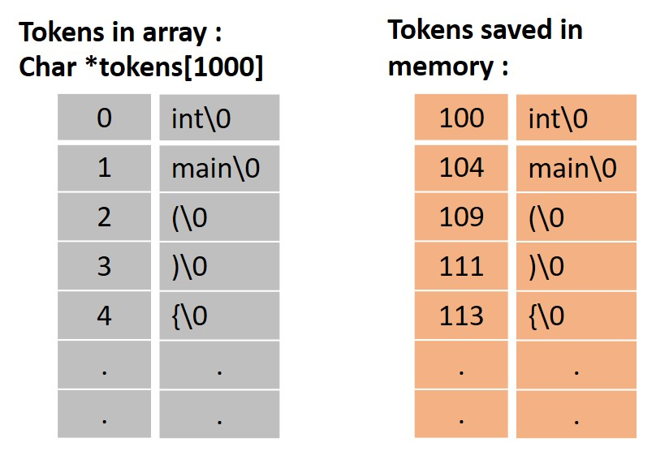

# Week 3 Notes
## Lexer
Lexer is a program that perform process of converting a sequence of character into tokens, an assigned string. For example we have a code like shown below :
```
#include "sum.h"

int main() {
  int t = sum(10);
  printf("sum(10)=%d\n", t);
}
```
> code reference https://gitlab.com/ccc109/sp/-/tree/master/03-compiler/02-lexer

<br>



> suppose we have a code like the above image. Lexer will read for each character and make them into one tokens if they already fulfill specific conditions.

<br>



> The image above show how tokens was saved in array and memory. As you can see, in memory the address looks not in order because for every variable stored in it need a space depend on it's size. In this case each character need space 1 byte of memory. So if token "int" is saved at memory address 100, because it has 3 characters so the next token will be saved at 104.

after lexing the code, if we try to print the tokens we will get a sequence of tokens like this :
```
token=#
token=include
token="sum.h"
token=int
token=main
token=(
token=)
token={
token=int
token=t
token==
token=sum
token=(
token=10
token=)
token=;
token=printf
token=(
token="sum(10)=%d\n"
token=,
token=t
token=)
token=;
token=}
```

---
<br>

## Notes for C
