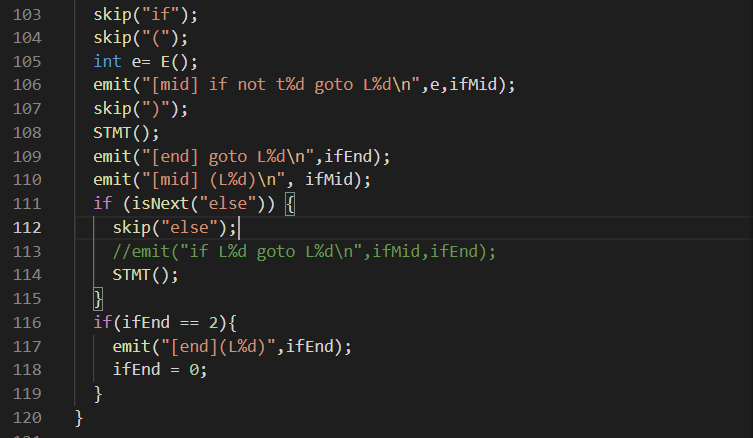

# Week 4 Notes
## Parser
In compiler, the parser will obtain a string of tokens from lexical analyzer. It then will verifies whether the string can be the grammar for the source language or not.

## Practice writing a simple parser
In this practice I used program refer to [ccc109-compiler2](https://gitlab.com/ccc109/sp/-/tree/master/03-compiler/03b-compiler2). I have do some modification to this code by adding if condition and for loop parser. I also add some extra output to make the program flow easier to understand ( Open [compiler.c](https://github.com/NubletZ/sp109b/blob/nubletz/Notes/Week4/compiler.c) to see the full parser code ). To use this program we need to open the directory in terminal and then run the folowing command :

1). Write the command below to compile the program 
```
$ make
```
2). To parse the code, run the compiler.exe
```
$ ./compiler.exe filename
```

### 1. If condition
<details><summary>Click me to SHOW the full parser code</summary>

```
void IF() {
  if (labelIdx == 0){ // only will print "(L0)" at the first line of parse
    int ifBegin = nextLabel(); //labelIdx++
    emit("(L%d)\n",ifBegin);
  }
  int ifMid = nextLabel(); //labelIdx++
  if (labelIdx <= 2){ //to skip 2 from ifMid, because it's already been used by ifEnd
    nextLabel(); //labelIdx++
  }
  skip("if");
  skip("(");
  int e= E();
  emit("[mid] if not t%d goto L%d\n",e,ifMid);
  skip(")");
  STMT();
  emit("[end] goto L%d\n",ifEnd);
  emit("[mid] (L%d)\n", ifMid);
  if (isNext("else")) {
    skip("else");
    //emit("if L%d goto L%d\n",ifMid,ifEnd);
    STMT();
  }
  if(ifEnd == 2){
    emit("[end] (L%d)",ifEnd);
    ifEnd = 0;
  }
}
```

</details>

<br>

For example if we have a C code :

```
if (a == 3) {
    b = 4;
}
else if (a > 4) {
    b = 8;
}
else {
    b = a;
}
```
> code from [elseif.c](https://github.com/NubletZ/sp109b/blob/nubletz/Notes/Week4/elseif.c) 

To parse this if condition code, we need to add IF statement in compiler.c and add the statement in STMT function.


>adding if statment into STMT function.


the code above define ifBegin, ifMid and ifEnd. I use this three integer to show the program flow in parsing. In this code, emit have the same function as printf so it will show the string in its parenthesis as the output.

in parsing the code, because we don't need to care some token such as "if", "{", "}", "(", ")", so we can just skip it. The E function would then process the if condition value in parenthesis. After that it would continue to check for the next statement by calling STMT function. It would then read program inside curl bracket. For example, remember that in our first if condition code we got that b = 4. 

```
if (a == 3) {
    b = 4;
}
```

After parsing it, we will got output like this:

```
t0 = 4
b = t0
```

The parser would then keep repeating the above function for all statements (if, else if, else) and read until the end of the code. By using this program to compile our C code example, we would got this output:

```
if (a == 3) {
    b = 4;
}
else if (a > 4) {
    b = 8;
}
else {
    b = a;
}

============ parse =============
(L0)
t0 = a
t1 = 3
t2 = t0 == t1
[mid] if not t2 goto L1
t3 = 4
b = t3
[end] goto L2
[mid] (L1)
t4 = a
t5 = 4
t6 = t4 > t5
[mid] if not t6 goto L3
t7 = 8
b = t7
[end] goto L2
[mid] (L3)
t8 = a
b = t8
[end] (L2)
```


> Parse tree from the code

<br>

### 2. For Loop
<details><summary>Click me to SHOW the full parser code</summary>

```
void FOR() {
  int forBegin = nextLabel(); // mark label for the loop start point
  int forEnd = nextLabel(); // mark label for the end of loop
  skip("for");
  skip("(");
  ASSIGN(); // read for the initialization statement
  emit("(L%d)\n", forBegin);
  int e = E(); // read for the test sxpression
  emit("if not t%d, goto L%d\n", e, forEnd);
  skip(";");
  F(); // read for the update statement
  skip(")");
  STMT(); // read the content in curl bracket
  emit("goto L%d\n", forBegin);
  emit("(L%d)\n", forEnd);
}
```

</details>

<br>

Let's write a simple for loop program to test this parser code :
```
for (i = 3; i < 5; i++) {
    c = c + 3;
    for (j = 2; j < 6; j--) {
        a = b + 2;
    }
}
```
> code from [for.c](https://github.com/NubletZ/sp109b/blob/nubletz/Notes/Week4/for.c)

<br>

To parse this code we need to add FOR function in compiler.c and also add for statement in STMT function


> adding for into statment

<br>


In code shown above forBegin has a function as the loop point at the begining of for function after it define its initialization statement, while forEnd is the point at the end of for code.

<br><br>


Just like in if parser, unused token such as "for", "(", ")", "{", "}", ";", would be skiped. There are four main function that will read different part of for function :

* `ASSIGN()` = this function will read the initialization statement
* `E(`) = this function will read the test expression (e.x i < 9, i == 2, i > 0).
* `F()` = this will read the update statement in for (e.x i++, i--).
* `STMT()` = this will read the content from for (the code that written in curl bracket).

we then would get an output as what written below :
```
for (i = 3; i < 5; i++) {    
    c = c + 3;
    for (j = 2; j < 6; j--) {
        a = b + 2;
    }
}

============ parse =============
t0 = 3
i = t0
(L0)
t1 = i
t2 = 5
t3 = t1 < t2
if not t3, goto L1
i = i + 1
t5 = c
t6 = 3
t7 = t5 + t6
c = t7
t8 = 2
j = t8
(L2)
t9 = j
t10 = 6
t11 = t9 < t10
if not t11, goto L3
j = j - 1
t14 = 2
t15 = t13 + t14
a = t15
goto L2
(L3)
goto L0
(L1)
```
