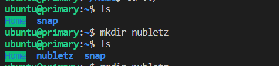

# Week 5 Notes
## Compile C Program in Linux (PART I)
### Install Virtual Machine in Windows
In this part, I use multipass to enable running Linux environment in my windows PC. To install multipass you can check their website on [multipass.run](https://multipass.run/). You can check whether the multipass has been successfuly installed in your PC or not by typing :
```
$ multipass version
```
If the multipass has been installed then you will find a similar output as this :
```
multipass  1.6.2+win
multipassd 1.6.2+win
```
After that, type the following command to open a shell on current terminal :
```
$ multipass shell
```


If you see an environment like the above image, that means you've entered Linux Shell.

<br>

### Install Git and GCC in Linux
Since I put all of my code in github so I need to install Git and clone my project into Linux. To install git you need to type :
```
$ sudo apt-get install git
```
after finished then just git clone the project. Besides Git the important things that we need to install is GCC. To install it first you need to update the package list :
```
$ sudo apt update
```
After all packages is up to date, then you can install build-essential package by typing :
```
$ sudo apt install build-essential
```
This command will install  new packages including gcc, g++ and make.
To validate that gcc has been installed you can type gcc --version to show its version :
```
$ gcc --version
```
Now since gcc already installed in our Linux then in the next part we can start to compile the program to be an executable file.