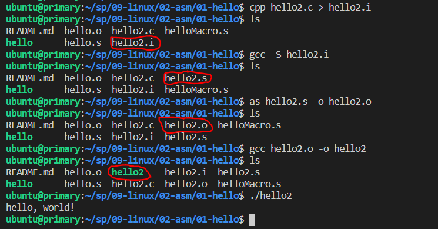

# Week 6 Notes
## Compile C Program in Linux (PART II)
### Compile Hello World! in Linux
Last time we already setup Linux environment and install gcc to it. Finally now we can start to compile our program code into an executable file. As an example I have a C code named hello.c that will simply print out "hello, world!", the code is written below :
```
#include <stdio.h>
int main()
{
  printf("hello, world!\n");
}
```
But we still can't run this file, as it's just a C code and not an executable file.
The next following command will compile hello2 into an executable file hello2. There are four phases in compilation :

### 1). Preprocessing
Preprocessing is the first compilation process where preprocessor directives are expanded. This stage will result file with .i suffix. Usualy it won't be save into disk unless the -save-temps option is used. To perforp preprocessing, type the following command :
```
$ cpp hello2.c > hello2.i
```
By typing the above command you'll be able to find hello2.i in your directory.

### 2). Compilation
In this stage, hello2.i would be translated into hello2.s. This file contains assembly code. Execute the command below to start translating :
```
$ gcc -S hello2.i
```
The command line option -S make the compiler to convert preprocessed codeto assembly language without creating an object file.

### 3). Assembly
Next the assembler (as) will translates hello.s into machine language and generates an object file hello2.o. Write the following command and execute it to translate hello.s :
```
$ as hello2.s -o hello2.o
```

### 4). Linking
In this final compilation stage, as you know for your "hello world!" program you need a printf function to print out "hello world!". So we must merged the object file printf.o and our hello2.o. The linker (ld) performs this task for you, but by using ld we need to write a long and complex command since we need to write a lot of directory path in order to merge them. Instead of ld now we can use gcc, it will handled the process transparantly when invoked, you can type the following command:
```
$ gcc hello2.o -o hello2
```
Now if you check in your directory you will find an executable file hello2. In Linux the executable file would be written in a different color (usually green).

---

<br>

The image below show the whole interaction of compiling hello2.c in Linux. File that I marked is the output result.


