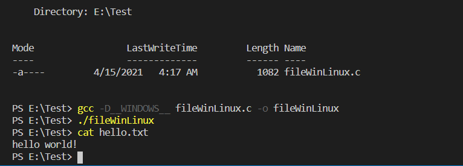

# Week 7 Notes
## What is POSIX?
POSIX (Portable Operating System) standard is a  document that released by the IEEE, to clarify and make uniform the application programming interfaces (API) provided by Unix-y OS. When you write a program based on POSIX standards, you can port them easily in Unix, Linux, and other derivative OS.

## Write C With POSIX
For the code example, the following code will print out and write "hello world!" into hello.txt file.
```
// file.c
#include <stdio.h>
#include <unistd.h> //using POSIX
#include <assert.h>
#include <fcntl.h>
#include <sys/stat.h>
#include <sys/types.h>
#include <string.h>

int main(int argc, char *argv[]) {
    int fd = open("hello.txt", O_WRONLY | O_CREAT | O_TRUNC, S_IRUSR | S_IWUSR);
    assert(fd >= 0);
    char buffer[20];
    sprintf(buffer, "hello world!\n");
    int rc = write(fd, buffer, strlen(buffer));
    assert(rc == (strlen(buffer)));
    fsync(fd);
    close(fd);
    return 0;
}
```
The code above is written using POSIX. The function such as open(), close(), fscync() are part from `unistd.h` library which belongs to POSIX. This way you only can compile this program in Unix, Linux, and other derivative OS, you won't be able to compile this in Windows neither in MacOS.

## Try to Write a C Program for Linux and Windows
To make a program can run in both Linux and Windows, then you can try to use `ifdef`, `ifndef`, `endif`. This several commands will come in handy to convert some of your program function and the library that you used in a specific condition. I take an example from [ccc109/sp](https://gitlab.com/ccc109/sp/-/blob/master/08-posix/01-basic/fileWinLinux.c) and modify it a little bit, so that we can run this program in Windows.

```
//fileWinLinux.c
//reference : https://gitlab.com/ccc109/sp

#include <stdio.h>
#include <assert.h>
#include <string.h>
#include <fcntl.h>
#include <sys/stat.h>
#include <sys/types.h>

// #define __POSIX__
#ifdef __POSIX__
#define datafd fd
#define Status 0
#include <unistd.h>
#endif

#ifdef __WINDOWS__
#include <io.h>
#include <math.h>
#define Status 1
#define datafd _fd //switch variable that passed since fsync(int) while fflush(FILE)
#define fsync fflush //change fsync into fflush which has a similar function
#define open _open //using Microsoft POSIX-style low-level IO calls
#define close _close //using Microsoft POSIX-style low-level IO calls
                     //ref:https://docs.microsoft.com/en-us/cpp/c-runtime-library/reference/open-wopen?view=msvc-160
#endif

FILE *_fd;

int main(int argc, char *argv[]) {
    int fd = open("hello.txt", _O_WRONLY | _O_CREAT | _O_TRUNC, _S_IRUSR | _S_IWUSR);
    if (Status == 1) _fd = fopen("hello.txt", "wb");
    assert(fd >= 0);
    char buffer[20];
    sprintf(buffer, "hello world!\n");
    int rc = write(fd, buffer, strlen(buffer));
    assert(rc == (strlen(buffer)));
    fsync(datafd);
    close(fd);
    return 0;
}
```
> to see the code refer to this link [Nubletz/fileWinLinux.c](https://github.com/NubletZ/sp109b/my%20C%20code/fileWinLinux.c)

As you can see from the code above, I separate between `__POSIX__` and `__WINDOWS__`.

```
// #define __POSIX__
#ifdef __POSIX__
#define Status 0
#include <unistd.h>
#endif
```
If the defined value is `__POSIX__` then compiler will set Status into 0 and use `unistd.h` library.
```
#ifdef __WINDOWS__
#include <io.h>
#include <math.h>
#define Status 1
#define datafd _fd 
#define fsync fflush 
#define open _open 
#define close _close 
#endif
```
Otherwise if the defined value is `__WINDOWS__` then this program will :
* use `io.h` and `math.h` library
* set Status into 1
* change open function into _open, and close function into _close. The functions that start with underline are functions from Microsoft POSIX-style low-level I/O calls. This POSIX-style is excutable in Windows.
* change fsync function into fflush. If we run the program in `__WINDOWS__` since fsync come from `unistd.h` library which we can't use in windows so we can try to use fflush function that have a simillar function with it, but it still need more research.

<br>
Here is the result after compile and run the excutable file in Windows :


<br>

Result from compile the program and run its excutable file in Linux :


The attribute `-D` after the `gcc` command is stand for define

So that's my experiment to make a program that use POSIX also can be compiled in Windows :)