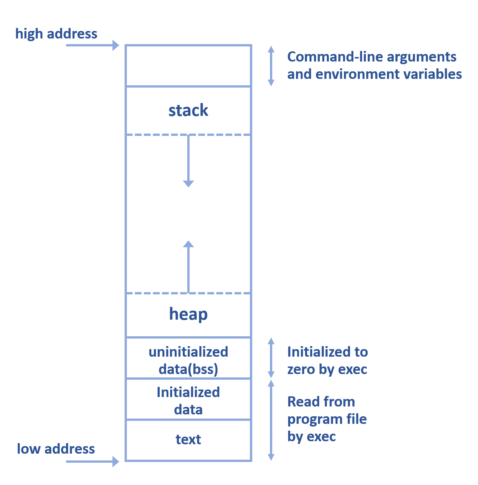

# Week 8 Notes
## C Memory Layout
The memory representation of a C program is devided into several sections :



1). `Text (Code Segment)` is an area for the program's executable code. It's placed below heap or stack to prevent heaps and stack overflows from overwriting it.

2). `Initialized Data Segment` contains global, static, constant, and external variables that are initialized in the code.

3). `Uninitialized Data Segment (bss)` in this segment all variables that don't have value would be initialized to zero `0` before the program starts executing. 

4). `Heap` is the segment which store dynamic memory allocation.

5). `Stack` is a segment which store all local variables and is used for passing arguments into functions along with the return address of instruction that will be executed after the function call is over.

<br>

## Command
### 1). Show currently-running program

In one operating system can have so many process, use the following command to check for the list of process that is currently running :

```
$ ps -A
```

---

### 2). Running program in the background
You can add "&" at the end of your command to execute it in the background. For example you can ping 8.8.8.8, save the result into a file and execute it in the background : 

```
$ ping 8.8.8.8 > myLog.txt &
```

it will then show the output like `[1] 2990` here the 2990 is the process ID, you can use this ID to call your program and terminate it :

```
$ kill <processID>
```